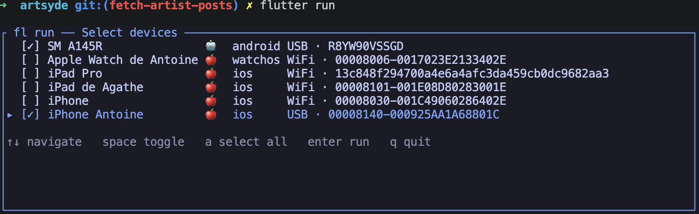
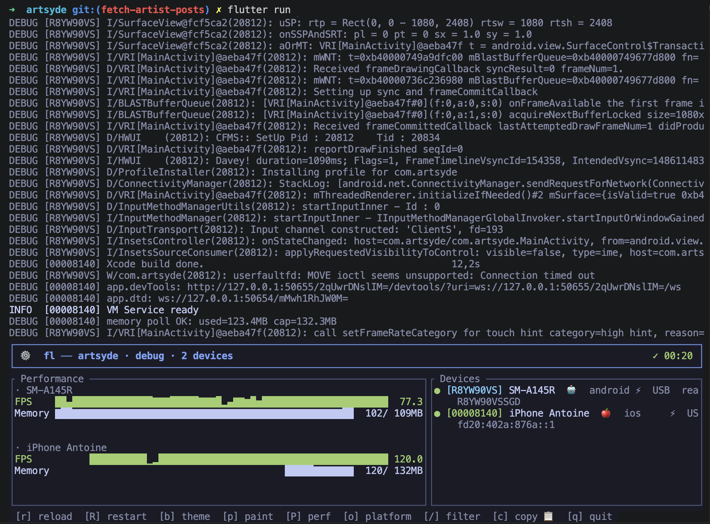
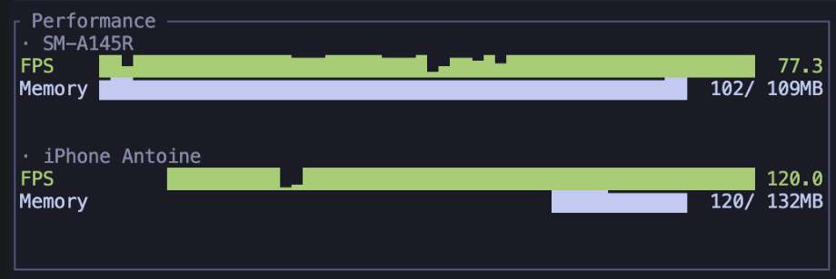
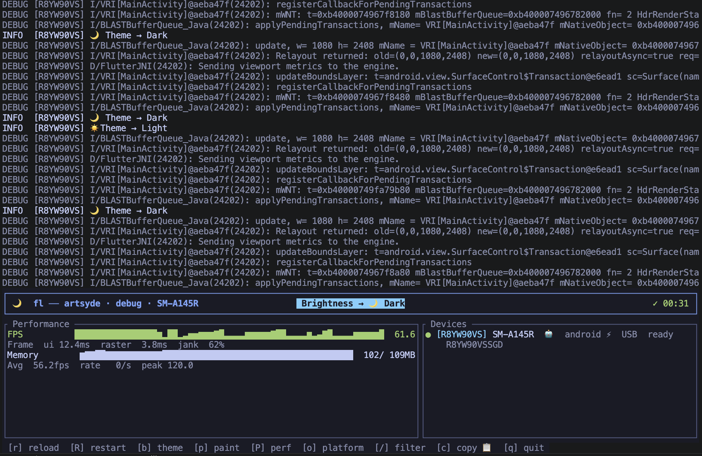
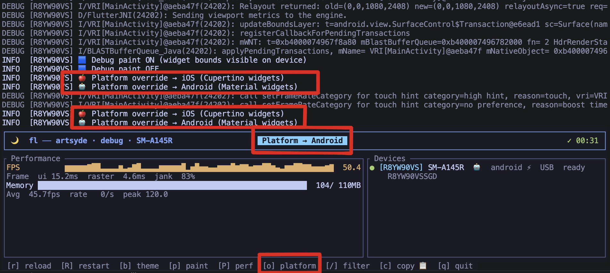
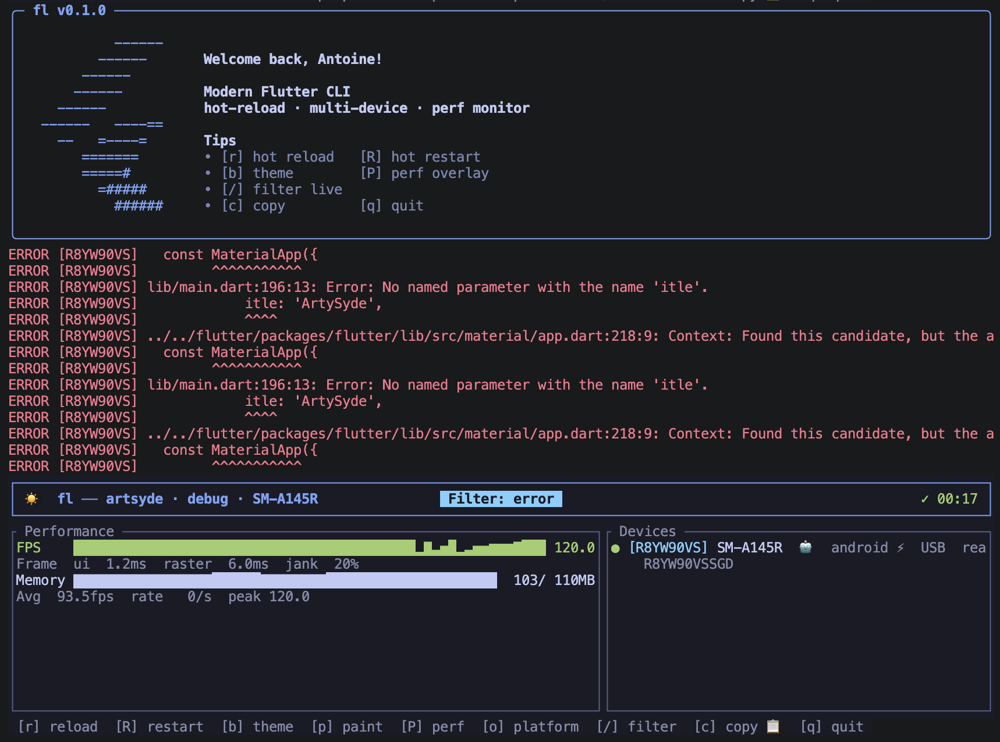
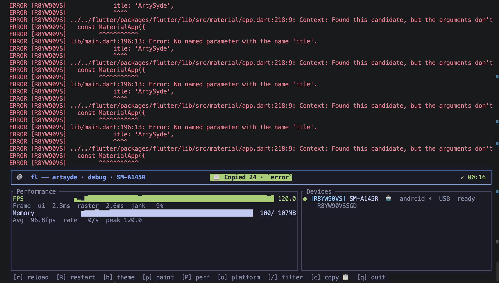
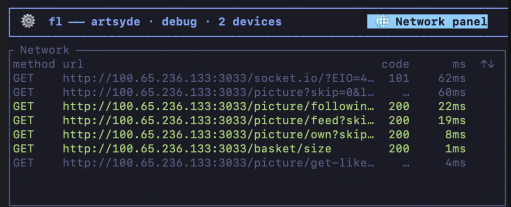
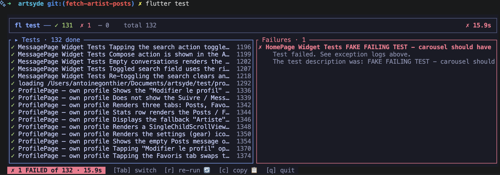

<div align="center">

# `flutter run`, but with superpowers.

A modern terminal UI for Flutter — hot reload across N devices, real-time perf, inline scrollback.
Drops into your shell so `flutter run` *becomes* the dashboard. No new command to learn.


*One line in your shell config turns `flutter run` into this — welcome banner, inline dashboard, scrollback preserved.*

</div>

---

## Install

Works on **macOS, Linux and Windows**, with **bash, zsh, fish** and Git Bash / WSL on Windows.

```sh
curl -fsSL https://raw.githubusercontent.com/Antoinegtir/flutter-cli/master/install.sh | bash
```

The installer drops a single helper on your `PATH` and adds **one line** to whichever shell config it detects (`~/.bashrc`, `~/.zshrc`, `~/.config/fish/config.fish`):

```sh
eval "$(flutter-cli init <your-shell>)"   # bash | zsh | fish
```

Reload your shell, then:

```sh
flutter run
```

🪄 The TUI takes over. Your IDE keeps using vanilla `flutter` (the shim only fires in your terminal), and `flutter pub`, `flutter doctor`, `flutter clean` — anything we don't enhance — passes through unchanged.

**To remove, run `./uninstall.sh` or delete the eval line.** Non-invasive by design.

### Don't want a shim?

You can also call the binary directly — `flutter-cli run`, `flutter-cli test`, `flutter-cli build`. Same TUI, no shell wiring needed. Handy on CI runners or locked-down corporate machines where rc files are off-limits.

---

## Why

`flutter run` was written for one device, one developer, one terminal. In 2025 you're probably:

- Testing on **2+ devices simultaneously** (iOS, Android, simulator).
- Watching FPS, memory, jank ratios — not just compile errors.
- Drowning in 50,000 lines of scrollback per session.
- Re-typing the same `flutter run --device emulator-5554 --flavor prod` for the hundredth time.

Same project, same `flutter` binary underneath, dramatically better feedback loop.

| | vanilla `flutter run` | with the shim |
|---|---|---|
| Multi-device hot reload | one at a time | parallel, single `r` |
| Per-device FPS / memory | no | yes, live sparklines |
| Inline TUI (scrollback preserved) | no | yes |
| Device picker | text prompt | navigable list with `space`/`a` |
| Survives `--release` rebuild flags | manual `--mode` | native `--release` / `--profile` |
| Add `--flavor`, `--dart-define` | works | works (`-- --flavor prod`) |
| Open DevTools in browser | copy URL manually | `d` keystroke |
| Live HTTP traffic inspector | DevTools-only | `n` keystroke, in your terminal |
| Side-by-side device screenshots | per-platform tooling | `s` keystroke, every device at once |
| Skip the TUI when you need to | n/a | `--basic` (CI, piping, debugging) |

---

## What you can do

### `flutter run` — multi-device dashboard

```sh
flutter run                    # auto-pick or device picker
flutter run --release          # release mode
flutter run -d emulator-5554   # specific device
flutter run -d all             # every connected device, hot reload broadcasts
flutter run -- --flavor prod --dart-define=API=https://x   # any flutter run flag
```

When several devices are connected, an interactive picker shows up — multi-select with `space`, select all with `a`, confirm with `enter`:



Once you've picked, the dashboard shows one performance block per device with live FPS / memory sparklines:



Per-device, the Performance panel breaks down FPS, frame timings (ui / raster), jank ratio and memory pressure independently — so you can tell *which* device just dropped to 30 fps without squinting:



While running:

| key | action |
|---|---|
| `r` | hot reload (all devices) |
| `R` | hot restart (all devices) |
| `b` | toggle brightness (light / dark) |
| `p` | toggle debug paint |
| `P` | toggle performance overlay |
| `o` | toggle platform (iOS / Android) |
| `s` | screenshot every device → `screenshots/<timestamp>/<device>.png` |
| `n` | toggle the live HTTP network inspector |
| `d` | open Flutter DevTools in your browser |
| `↑` / `↓` | scroll the active panel (logs or network) |
| `/` | filter logs live |
| `c` | copy logs to clipboard |
| `q` | quit |

#### Live device toggles, no IDE round-trip

Press `b` to flip the system theme between light and dark on the running app — exactly the kind of test you used to need a 30-second tap dance through device settings for:



Press `o` to fake the platform: an Android device suddenly thinks it's iOS (Cupertino widgets) and vice-versa. Pairs nicely with `p` (debug paint) when you're chasing layout differences between platforms:



#### Live log filtering

Press `/`, type — logs are filtered **as you type** (substring match on either the message body or the level name `error` / `warn` / `info` / `debug`). Press `Enter` to freeze the filter, `Esc` to cancel.



#### Copy logs to the clipboard

Press `c` to copy the visible log buffer. If a filter is active, **only the matching lines are copied** — perfect for triaging a noisy stack trace into a chat or an issue.



#### Live network inspector

Press `n` to swap the Performance panel for a live HTTP traffic view — every request your app makes via `dart:io` (or `package:http`, which wraps it) is captured through the Dart VM Service's `getHttpProfile` extension and displayed with method, URL, status code and duration. Color-coded by HTTP status family (green 2xx, yellow 4xx, red 5xx). `↑` / `↓` scrolls back through the history, `Enter`/`n` again returns to Performance.



#### One-keystroke screenshots of every device

Press `s` to capture the current frame on every connected device **in parallel**. PNGs land in `screenshots/<timestamp>/<device-name>.png` — ready to drop into a Slack thread, a PR, or App Store assets. Works on iPhone, Android, simulators and desktop without installing per-platform tooling: the capture goes through the VM Service's `_flutter.screenshot` RPC first (zero deps), with `flutter screenshot` / `adb` / `idevicescreenshot` / `simctl` as fallbacks.

```
[iPhone Antoine] 📸 saved screenshots/2026-05-19_20-26-50/iPhone_Antoine.png (vmservice)
[sdk gphone64 arm64] 📸 saved screenshots/2026-05-19_20-26-50/sdk_gphone64_arm64.png (vmservice)
📸 2/2 screenshots in screenshots/2026-05-19_20-26-50
```

#### Open DevTools straight from the TUI

Press `d` to open Flutter DevTools in your default browser for every running session. The URL is grabbed live from the daemon's `app.devTools:` log line, so no copy-pasting and no waiting for "what's the address again?" — it just opens. On macOS uses `open`, elsewhere `xdg-open`.

### `flutter test` — every test type

Test runner with a live failures panel — pass/fail/skip counters update in real time, and any failure jumps straight to the stack trace on the right. `Tab` switches focus between the tests list and the failures panel, `c` copies the failures only, `r` re-runs.



```sh
flutter test                              # everything under test/
flutter test test/widget_test.dart        # one file
flutter test test/auth/                   # one directory
flutter test integration_test/            # e2e — picker fires automatically
flutter test --golden                     # golden tests under test/golden/
flutter test --golden --update-goldens    # regenerate
flutter test --coverage                   # writes coverage/lcov.info
flutter test --tags slow --exclude-tags flaky
flutter test --reporter expanded -j 4
flutter test -- --start-paused --total-shards 4   # anything else
```

### `flutter build` — any target

```sh
flutter build                       # lists subcommands (forwards to flutter)
flutter build apk
flutter build ios --release
flutter build ipa
flutter build macos
flutter build ios -- --no-codesign --obfuscate --split-debug-info=symbols/
```

### `flutter devices`

Live-tracked list with status, IP, battery, OS version. Same data the picker uses.

### Skipping the TUI: `--basic`

Every command supports a `--basic` flag that drops the TUI and just `exec`s the real `flutter` binary with stdio inherited. Useful in CI, when piping into another tool, or when the TUI itself is masking an obscure tool error.

```sh
flutter run --basic                     # vanilla `flutter run` output
flutter test --basic --coverage         # vanilla `flutter test` output
flutter test integration_test/ --basic
flutter build apk --basic --release
```

No `--machine`, no JSON parsing, no per-device prefix — exactly the same logs you'd get if `fl` weren't on your `PATH`. The shim still picks up the rest of the `flutter` subcommands.

---

## How the shim works

The installer adds this block to your shell config (idempotent, gated by sentinel comments so removing it is one line away):

```sh
# >>> flutter-cli shim >>>
eval "$(flutter-cli init <shell>)"
# <<< flutter-cli shim <<<
```

For bash / zsh, that `eval` expands to roughly:

```sh
flutter() {
  case "$1" in
    run|test|build|devices) shift; command flutter-cli "$@" ;;
    *) command flutter "$@" ;;
  esac
}
```

…and for fish, the equivalent `function flutter ... switch $argv[1] ... end` with a `command flutter` fallback.

**That's the whole magic trick.** Four `flutter` subcommands routed through the TUI, everything else passes through to the real binary. Your IDE plugins, CI pipelines, and dotfile zealotry are untouched.

---

## Manual install (without the script)

```sh
git clone https://github.com/Antoinegtir/flutter-cli
cd flutter-cli
cargo install --path crates/fl-cli
```

Then wire the shim into the shell config of your choice:

```sh
# bash
echo 'eval "$(flutter-cli init bash)"' >> ~/.bashrc

# zsh
echo 'eval "$(flutter-cli init zsh)"'  >> ~/.zshrc

# fish
echo 'flutter-cli init fish | source'  >> ~/.config/fish/config.fish
```

Or skip the shim entirely and call `flutter-cli run` / `test` / `build` directly.

---

## Roadmap

- **Wi-Fi takeover on USB unplug** (Android — already pre-pairs; iOS work-in-progress).
- **VS Code / Android Studio integration** so the TUI fires inside IDEs too.
- **Recorded perf traces** export (Devtools JSON).
- **Watch mode** for `flutter test` (re-run on file change).

Open an issue if you have a use case `flutter run` makes painful — that's exactly what this project is for.

---

## Contributing

```sh
git clone https://github.com/Antoinegtir/flutter-cli
cd flutter-cli
cargo test --workspace
```

PRs welcome — `cargo fmt`, `cargo clippy -D warnings`, and `cargo test --workspace` are checked by CI.

---

## License

MIT — see [LICENSE](LICENSE).

Built by [@Antoinegtir](https://github.com/Antoinegtir).
