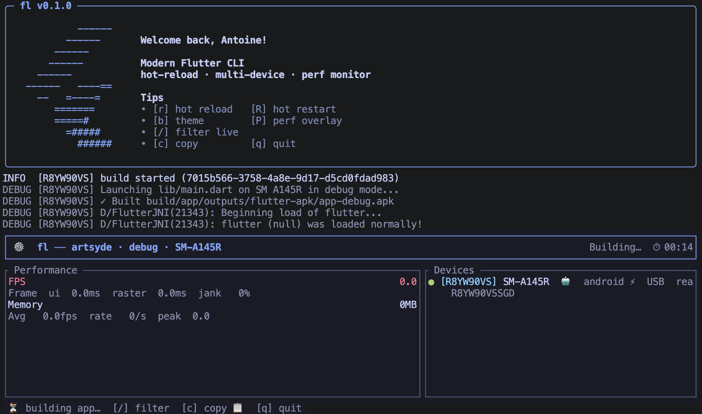

<div align="center">

# `flutter run`, but with superpowers.

A modern terminal UI for Flutter — hot reload across N devices, real-time perf, inline scrollback.
Drops into your shell so `flutter run` *becomes* the dashboard. No new command to learn.



*One line in your `.zshrc` turns `flutter run` into this — welcome banner, inline dashboard, scrollback preserved.*

</div>

---

## Install

```sh
curl -fsSL https://raw.githubusercontent.com/Antoinegtir/flutter-cli/master/install.sh | bash
```

That's it. The script builds the binary, drops it on your `PATH`, and adds **one line** to your shell rc:

```sh
eval "$(fl init zsh)"   # zsh / bash / fish all supported
```

Reload your shell, then:

```sh
flutter run
```

🪄 The TUI takes over. Your IDE keeps using vanilla `flutter` (the shim only fires in your terminal), and `flutter pub`, `flutter doctor`, `flutter clean` — anything we don't enhance — passes through unchanged.

**To remove, run `./uninstall.sh` or delete the eval line.** Non-invasive by design.

---

## Why

`flutter run` was written for one device, one developer, one terminal. In 2025 you're probably:

- Testing on **2+ devices simultaneously** (iOS, Android, simulator).
- Watching FPS, memory, jank ratios — not just compile errors.
- Drowning in 50,000 lines of scrollback per session.
- Re-typing the same `flutter run --device emulator-5554 --flavor prod` for the hundredth time.

`fl` fixes that. Same project, same `flutter` binary underneath, dramatically better feedback loop.

| | `flutter run` | `fl` (via shim) |
|---|---|---|
| Multi-device hot reload | one at a time | parallel, single `r` |
| Per-device FPS / memory | no | yes, live sparklines |
| Inline TUI (scrollback preserved) | no | yes |
| Device picker | text prompt | navigable list with `space`/`a` |
| Survives `--release` rebuild flags | manual `--mode` | native `--release` / `--profile` |
| Add `--flavor`, `--dart-define` | works | works (`-- --flavor prod`) |

---

## What you can do

### `flutter run` — multi-device dashboard

```sh
flutter run                    # auto-pick or device picker
flutter run --release          # release mode
flutter run -d emulator-5554   # specific device
flutter run -d all             # every connected device, hot reload broadcasts
flutter run -- --flavor prod --dart-define=API=https://x   # any flutter run flag
```

When several devices are connected, an interactive picker shows up — multi-select with `space`, select all with `a`, confirm with `enter`:


Once you've picked, the dashboard shows one performance block per device with live FPS / memory sparklines:


Per-device, the Performance panel breaks down FPS, frame timings (ui / raster), jank ratio and memory pressure independently — so you can tell *which* device just dropped to 30 fps without squinting:


While running:

| key | action |
|---|---|
| `r` | hot reload (all devices) |
| `R` | hot restart (all devices) |
| `b` | toggle brightness (light / dark) |
| `p` | toggle debug paint |
| `P` | toggle performance overlay |
| `o` | toggle platform (iOS / Android) |
| `/` | filter logs live |
| `c` | copy logs to clipboard |
| `q` | quit |

#### Live device toggles, no IDE round-trip

Press `b` to flip the system theme between light and dark on the running app — exactly the kind of test you used to need a 30-second tap dance through device settings for:


Press `o` to fake the platform: an Android device suddenly thinks it's iOS (Cupertino widgets) and vice-versa. Pairs nicely with `p` (debug paint) when you're chasing layout differences between platforms:


#### Live log filtering

Press `/`, type — logs are filtered **as you type** (substring match on either the message body or the level name `error` / `warn` / `info` / `debug`). Press `Enter` to freeze the filter, `Esc` to cancel.


#### Copy logs to the clipboard

Press `c` to copy the visible log buffer. If a filter is active, **only the matching lines are copied** — perfect for triaging a noisy stack trace into a chat or an issue.


### `flutter test` — every test type

Test runner with a live failures panel — pass/fail/skip counters update in real time, and any failure jumps straight to the stack trace on the right. `Tab` switches focus between the tests list and the failures panel, `c` copies the failures only, `r` re-runs.


```sh
flutter test                              # everything under test/
flutter test test/widget_test.dart        # one file
flutter test test/auth/                   # one directory
flutter test integration_test/            # e2e — picker fires automatically
flutter test --golden                     # golden tests under test/golden/
flutter test --golden --update-goldens    # regenerate
flutter test --coverage                   # writes coverage/lcov.info
flutter test --tags slow --exclude-tags flaky
flutter test --reporter expanded -j 4
flutter test -- --start-paused --total-shards 4   # anything else
```

### `flutter build` — any target

```sh
flutter build                       # lists subcommands (forwards to flutter)
flutter build apk
flutter build ios --release
flutter build ipa
flutter build macos
flutter build ios -- --no-codesign --obfuscate --split-debug-info=symbols/
```

### `flutter devices`

Live-tracked list with status, IP, battery, OS version. Same data the picker uses.

---

## The shell shim

The install script adds this to your rc file (idempotent, gated by sentinel comments):

```sh
# >>> fl shim >>>
eval "$(fl init zsh)"
# <<< fl shim <<<
```

What it actually defines:

```sh
flutter() {
  case "$1" in
    run|test|build|devices) shift; command fl "$@" ;;
    *) command flutter "$@" ;;
  esac
}
```

**That's the whole magic trick.** Four subcommands routed through `fl`, everything else passes through. You can read the full output anytime with `fl init zsh`.

---

## Manual install (without the script)

```sh
git clone https://github.com/Antoinegtir/flutter-cli
cd flutter-cli
cargo install --path crates/fl-cli
eval "$(fl init zsh)" >> ~/.zshrc
```

Or use `fl` directly without the shim if you prefer the explicit form (`fl run`, `fl test`, etc.).

---

## Roadmap

- **Wi-Fi takeover on USB unplug** (Android — already pre-pairs; iOS work-in-progress).
- **VS Code / Android Studio integration** so the TUI fires inside IDEs too.
- **Recorded perf traces** export (Devtools JSON).
- **Watch mode** for `flutter test` (re-run on file change).

Open an issue if you have a use case `flutter run` makes painful — that's exactly what this project is for.

---

## Contributing

```sh
git clone https://github.com/Antoinegtir/flutter-cli
cd flutter-cli
cargo test --workspace
```

The codebase is a Rust workspace organized by responsibility:

```
crates/
├── fl-core         shared event types, models
├── fl-adb          Android device discovery + Wi-Fi pre-pair
├── fl-ios          iOS device discovery via devicectl
├── fl-flutter      Flutter daemon JSON-RPC client
├── fl-vmservice    Dart VM Service WebSocket client
├── fl-tui          ratatui-based dashboard + views
└── fl-cli          binary entry point + command dispatch
```

PRs welcome — `cargo fmt`, `cargo clippy -D warnings`, and `cargo test --workspace` are checked by CI.

---

## License

MIT — see [LICENSE](LICENSE).

Built by [@Antoinegtir](https://github.com/Antoinegtir).
