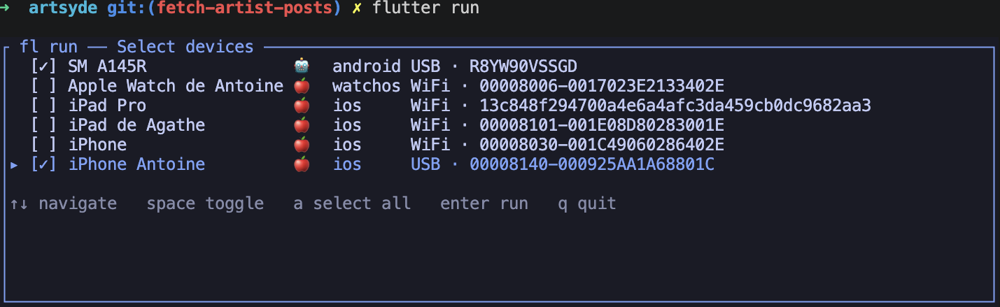
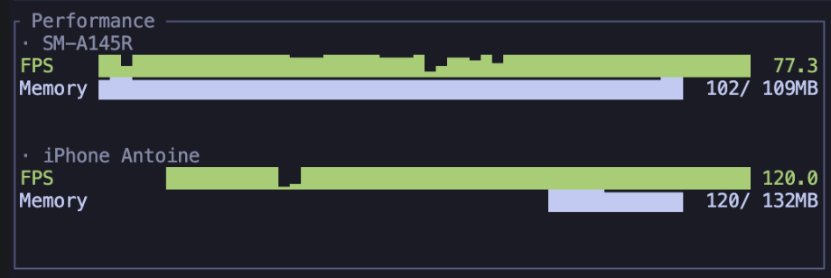
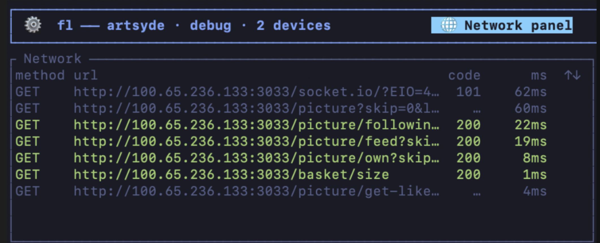
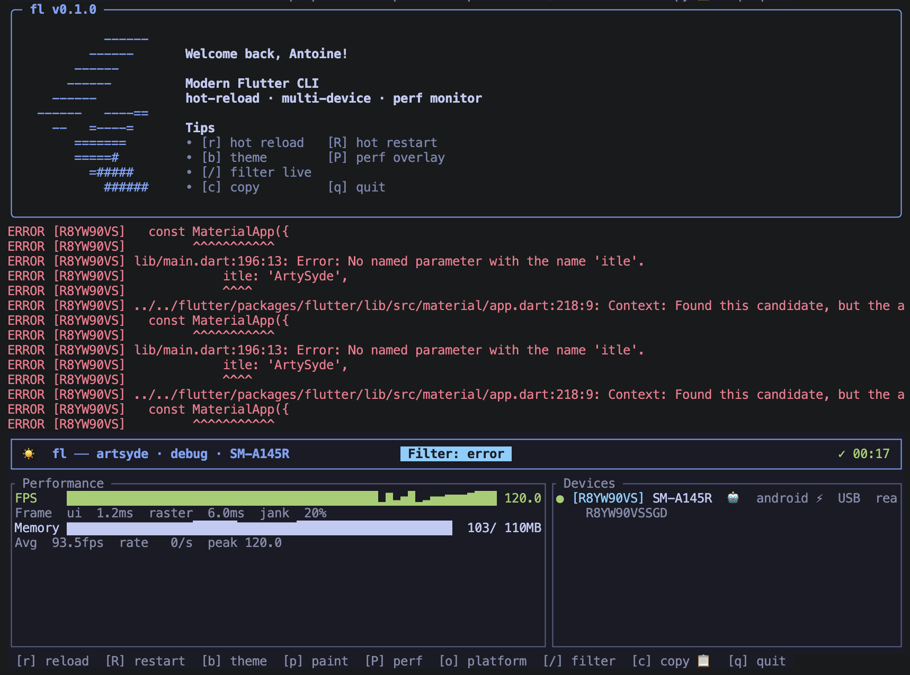
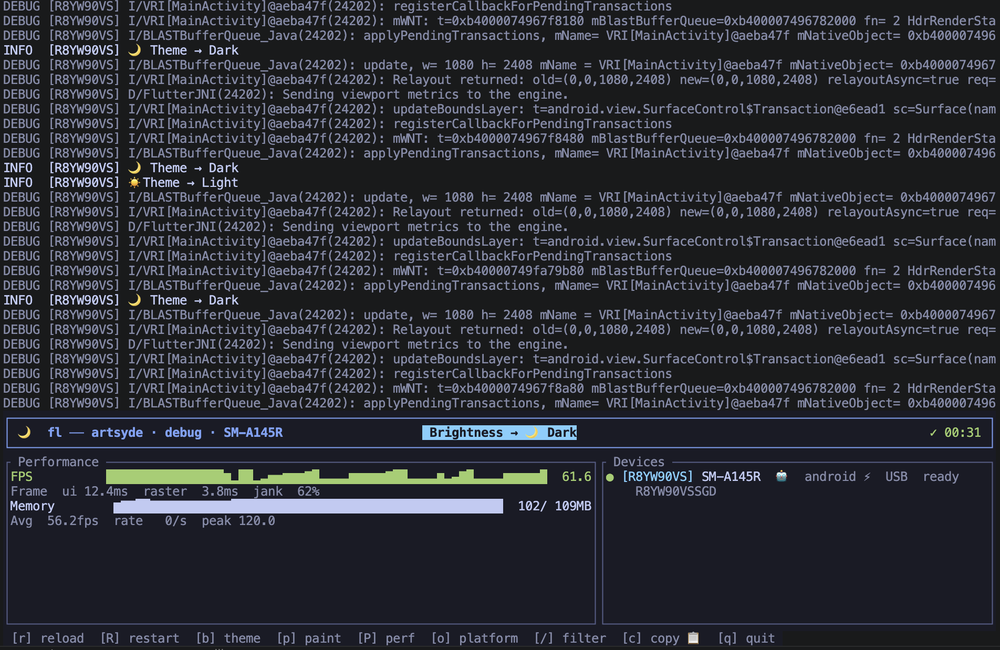
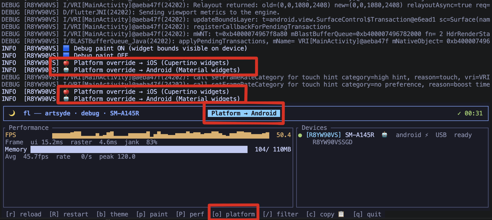
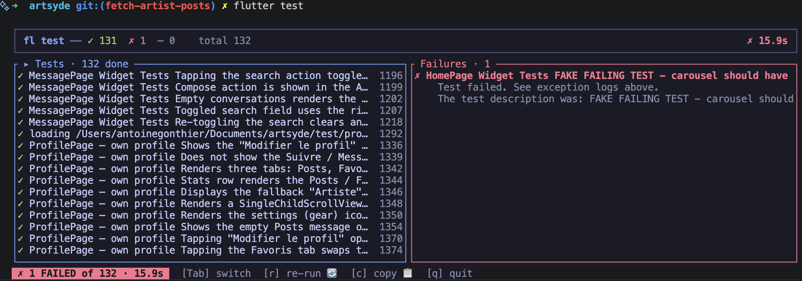

<div align="center">

**[English](README.md) | 简体中文**

# `flutter run`，但拥有超能力。

[](https://github.com/Antoinegtir/flutter-cli/releases/latest)
[](https://www.npmjs.com/package/@antoinegtir/flutter-cli)
[](LICENSE)
[](https://github.com/Antoinegtir/flutter-cli/discussions)

一个现代化的 Flutter 终端 UI —— 多设备同时热重载、实时性能监控、内联日志滚动。它会接管你的 shell，让 `flutter run` *直接变成* 仪表盘。


</div>

## 免安装试用

```sh
npx @antoinegtir/flutter-cli run
```

把二进制文件拉到 npm 缓存里，不写 shell 钩子、不改 rc 文件 —— 直接在当前项目上跑起仪表盘。把 `run` 换成 `test`、`build` 或 `devices` 即可。

## 安装

```sh
curl -fsSL https://raw.githubusercontent.com/Antoinegtir/flutter-cli/master/install.sh | bash
```
或者：
```sh
npm i -g @antoinegtir/flutter-cli
```

两种方式都会把二进制放进你的 `PATH`，并自动把 shell 钩子写进 rc 文件。打开一个新终端 —— `flutter run` / `test` / `build` / `devices` 现在都会走 TUI。你的 IDE 仍然使用原生 `flutter`；其他所有命令（`flutter pub`、`doctor`、`clean`……）原样透传，互不影响。

**环境要求：** 一个能通过 `PATH`、[FVM](https://fvm.app) 或 `$FLUTTER_ROOT` 找到的 Flutter SDK。支持 macOS / Linux / Windows（bash、zsh、fish、Git Bash、WSL）。

---

## 功能一览

**多设备选择器 —— `space` 选中，`a` 全选，`enter` 启动。**


**每台设备实时的 FPS + 内存折线图，并排展示。**


**按 `n` —— 完整的 HTTP 流量检查器，按状态码自动着色。**


**按 `/` —— 边输入边过滤日志，可按消息内容或日志级别筛选。**


**按 `b` —— 不离开终端，一键切换每台设备的浅色/深色模式。**


**按 `o` —— 给每台设备伪装成 iOS 或 Android，方便排查布局问题。**


---

### 支持 FVM

`flutter-cli` 会自动识别项目级的 FVM 配置：优先解析 `.fvm/flutter_sdk`（你的 IDE 读取的就是这个），然后回退到 `.fvmrc` / 旧版的 `.fvm/fvm_config.json`，对应 `~/fvm/versions` 下的版本。无需 `fvm flutter` 前缀，解析出的 Flutter / Dart 版本号会显示在仪表盘顶部。

### 启动前钩子（pre-run / pre-test / pre-build）

代码生成、测试数据准备、环境检查 —— 在 `pubspec.yaml` 里加一段 `flutter_cli:` 配置，这些命令会在 TUI 接管终端之前执行。任意一条命令非零退出都会中止启动。

```yaml
# pubspec.yaml
flutter_cli:
  pre_run:
    - dart run build_runner build --delete-conflicting-outputs
  pre_test:
    - dart run build_runner build
  pre_build:
    - ./tool/check_env.sh
```

每条命令都通过 `sh -c` 执行，所以管道、`&&`、环境变量替换都能正常工作。输出会实时打到你的终端 —— 仪表盘退出后，代码生成的进度日志依然可见。

### IntelliJ / Android Studio 热重载

应用一启动，`flutter-cli` 就会打印标准的 `A Dart VM Service on <device> is available at: http://…` 行。Flutter 的 IntelliJ 插件会抓取这个模式并自动 attach —— 之后在 IDE 里按 **Cmd+S 就能直接通过 VM Service 触发热重载**，无需任何额外配置。

### 升级

重新执行同一条安装命令即可 —— 幂等操作，无需重载：
```sh
curl -fsSL https://raw.githubusercontent.com/Antoinegtir/flutter-cli/master/install.sh | bash
```
或者：
```sh
npm update -g @antoinegtir/flutter-cli
```

### 卸载

```sh
curl -fsSL https://raw.githubusercontent.com/Antoinegtir/flutter-cli/master/uninstall.sh | bash
```
或者：
```sh
 npm uninstall -g @antoinegtir/flutter-cli
```

会从所有 shell 的 rc / profile 文件中移除钩子，并从所有已知目录删除二进制。干净利落，毫无残留。

### 直接调用二进制（不装钩子）

直接执行 `flutter-cli run` / `test` / `build`。适合 CI 环境，或那些你不方便改动 rc 文件的机器。

---

## 为什么做这个

`flutter run` 当初是为「一台设备、一个终端」设计的。但今天你通常是这样的：
- 同时在 2 台以上的设备上测试（iOS、Android、模拟器）。
- 盯着 FPS、内存、卡顿 —— 而不只是编译错误。
- 在 5 万行日志滚动里被淹没。
- 第一百次重新敲 `flutter run --device emulator-5554 --flavor prod`。

底层还是同一个 `flutter`，但反馈闭环天差地别：

| | 原生 `flutter run` | 装上钩子之后 |
|---|---|---|
| 多设备热重载 | 一次一台 | 并行，一个 `r` 搞定 |
| 每设备 FPS / 内存 | — | 实时折线图 |
| 内联 TUI（保留滚动历史） | — | 支持 |
| 设备选择器 | 文本提示 | 可导航的列表 |
| `--release` / `--profile` / `--flavor` / `--dart-define` | 支持 | 支持 |
| 打开 DevTools | 手动复制 URL | 按 `d` |
| 实时 HTTP 检查器 | 只能用 DevTools | 按 `n` |
| 并排截图 | 各平台单独工具 | 按 `s` |
| 跳过 TUI | 不适用 | `--basic` |

---

## 命令

### `flutter run` —— 多设备仪表盘

```sh
flutter run                    # 自动选择，或弹出交互式选择器
flutter run --release          # release 模式
flutter run -d emulator-5554   # 指定设备
flutter run -d all             # 所有已连接设备
flutter run -- --flavor prod --dart-define=API=https://x   # 任意 flutter 参数
```

运行时的快捷键：

| 按键 | 作用 |
|---|---|
| `r` / `R` | 热重载 / 热重启（所有设备） |
| `b` / `o` | 切换主题（浅色/深色）/ 伪装平台（iOS/Android） |
| `p` / `P` | 调试绘制 / 性能浮层 |
| `e` | 在 VS Code / Android Studio 中跳转到报错位置（或 ⌘+点击带下划线的引用） |
| `n` | 切换网络检查器 |
| `d` | 在浏览器中打开 Flutter DevTools |
| `s` | 截图每台设备 → `screenshots/<时间戳>/<设备>.png` |
| `/` | 实时过滤日志 · `c` 复制过滤后的内容 |
| `↑` / `↓` | 滚动当前面板 |
| `q` | 退出 |

截图优先走 VM Service 的 `_flutter.screenshot` RPC（零依赖），并以 `flutter screenshot` / `adb` / `idevicescreenshot` / `simctl` 作为回退方案。支持 iPhone、Android、模拟器和桌面端。

### `flutter test`

实时失败面板：通过 / 失败 / 跳过的计数实时更新，任意失败都能跳到对应的堆栈。`Tab` 切换焦点，`c` 复制失败项，`r` 重新运行。



```sh
flutter test                       # test/ 下的全部测试
flutter test test/auth/            # 指定目录
flutter test integration_test/     # e2e —— 自动弹出设备选择器
flutter test --golden --update-goldens
flutter test --coverage --tags slow --exclude-tags flaky
flutter test -- --start-paused --total-shards 4   # 任意额外参数
```

### `flutter build` —— 任意目标

```sh
flutter build apk
flutter build ios --release
flutter build ipa
flutter build macos
flutter build ios -- --no-codesign --obfuscate --split-debug-info=symbols/
```

### `flutter devices`

实时追踪的设备列表，含状态和系统版本。

### `--basic` —— 跳过 TUI

```sh
flutter run --basic              # 原生 `flutter run` 输出
flutter test --basic --coverage
flutter build apk --basic --release
```

适合 CI、把输出管道给其他工具，或者调试 TUI 本身。输出和 `flutter-cli` 不在 `PATH` 上时完全一致。

---

## 钩子的工作原理

安装脚本会往你的 rc 文件里加 3 行，用哨兵注释包起来，所以移除也是一行的事：
```sh
# >>> flutter-cli shim >>>
eval "$(flutter-cli init <shell>)"
# <<< flutter-cli shim <<<
```

这段 eval 会展开成一个函数：只把这 4 个被接管的子命令路由到 TUI，其余一律透传：
```sh
flutter() {
  case "$1" in
    run|test|build|devices) shift; command flutter-cli "$@" ;;
    *) command flutter "$@" ;;
  esac
}
```

自愈机制：万一 `flutter-cli` 消失了（被卸载、PATH 损坏……），这个函数会检测到并对所有调用回退到 `command flutter`，而不是直接报错。你的 IDE 插件、CI 流水线、以及对 dotfile 的洁癖，都不会被打扰。

---

## 手动安装（不用脚本）

```sh
git clone https://github.com/Antoinegtir/flutter-cli && cd flutter-cli
cargo install --path crates/flutter-cli
echo 'eval "$(flutter-cli init zsh)"' >> ~/.zshrc   # bash / fish 请替换为对应的 shell
```

---

## Docker

多阶段构建的 `Dockerfile`（Debian slim 运行时、非 root），适用于 CI 和受限的开发虚拟机。镜像**不**捆绑 Flutter SDK —— 挂载你自己的。

```sh
docker build -t flutter-cli:dev .
docker run --rm -it -v "$PWD":/work -w /work \
  -v "$FLUTTER_ROOT":/opt/flutter:ro \
  -e PATH=/opt/flutter/bin:/usr/local/bin:/usr/bin:/bin \
  flutter-cli:dev run --basic
```

Android USB 需要在宿主机上加 `--device /dev/bus/usb` 和 udev 规则。iOS 交互仅限 macOS（`xcrun`）。

---

## 参与贡献

```sh
git clone https://github.com/Antoinegtir/flutter-cli && cd flutter-cli
cargo test --workspace        # CI 同样会检查 `cargo fmt` 和 `cargo clippy -D warnings`
```

---

MIT 协议 —— 见 [LICENSE](LICENSE)。由 [@Antoinegtir](https://github.com/Antoinegtir) 打造。
